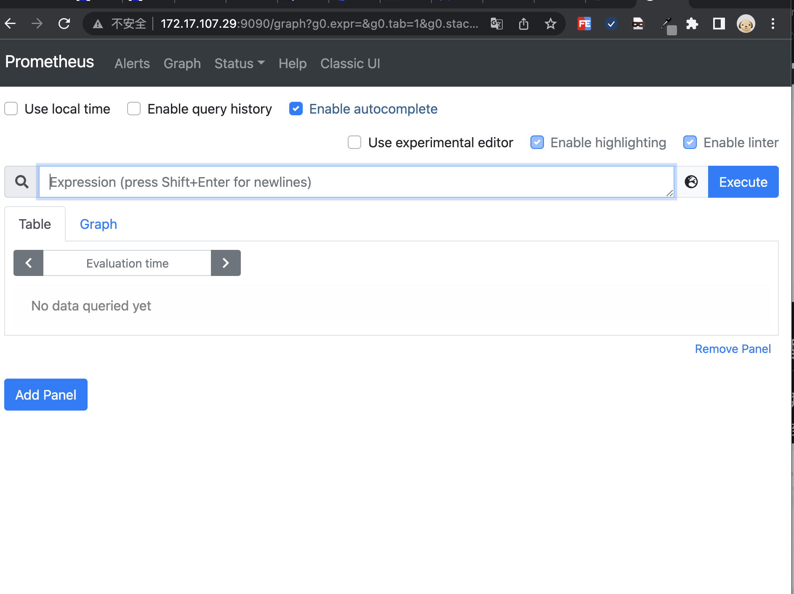

# 在kubeshare中使用devops部署java微服务配置监控预警
 
## 一、开发java微服务并引入监控组件
    我们基于spring cloud +nacos开发java微服务
    java服务开发不做过多的叙述
### 1.1 项目中引入Actuator
我们在项目的bom中引入Spring Boot Actuator 它提供了多种特性来监控和管理应用程序，可以基于 HTTP，也可以基于 JMX
```
         <dependency>
            <groupId>org.springframework.boot</groupId>
            <artifactId>spring-boot-starter-actuator</artifactId>
        </dependency>
```
### 1.2配置Actuator
引入actuator后原则上我们无需做任何配置即可使用，在我们项目中我们结合实际需求及提升安全性做了如下配置
```
management.health.elasticsearch.enabled=false
management.endpoints.web.exposure.include=*
management.endpoints.web.base-path=/api/actuator
management.metrics.tags.application=${service.name}
management.metrics.tags.appid=${service.appid}
management.server.port=8090
```
* management.server.port 启用独立的端口来提供监控，避免监控相关api暴露在服务外
* management.metrics.tags.xxx 在统计信息中添加自定义的标签
* management.endpoints.web.exposure.include 用于包含我们要公开的端点列表,我们这里设置为* 代表所有
### 1.2.1 观察应用程序监控数据
当我们运行编写好的程序后，通过访问 
http://localhost:8090/api/actuator/prometheus
可以看到类似如下数据，其中就有我们通过配置添加的tag数据
后续我们部署的monitor会通过如下地址将数据采集到普罗米修斯中


### 1.3 应用部署配置
#### 1.3.1 编写devops文件
```
pipeline {
  agent {
    node {
      label 'maven'
    }
  }
    options{
      buildDiscarder(logRotator(numToKeepStr: '10'))
    }
    parameters {
        string(name:'APP_NAME',defaultValue: 'accounts-service',description:'应用名称 必须使用小写 需跟maven构建中一致')
        string(name:'PROJECT_NAMESPACE',defaultValue: 'basebiz',description:'部署项目集名称')
        string(name:'SERVICE_SRC_PATH',defaultValue: 'accounts-service-webapp',description:'war包路径')
        string(name:'PROGECT_GIT_PATH',defaultValue:'basebiz/accounts-service.git',description:'项目gitlabpath ')
        string(name:'TAG_NAME',defaultValue: '',description:'tag 发布线上必须填写 格式v20210101(v+当前日期)')
        string(name:'PODCOUNT',defaultValue: '2',description:'部署pod数量')
        string(name:'HEALTH_CHECK_URI',defaultValue: '/api/actuator/health',description:'健康检测地址')
    }
    environment {
        //构建镜像
        REGISTRY = 'hub.xxxx.cn'
        DOCKERHUB_NAMESPACE = 'app'
        DOCKER_CREDENTIAL_ID = 'dockerhub-account' //hub账号密钥
        GITHUB_CREDENTIAL_ID = 'gitlab-account' //gitlab账号密钥
        //环境部署凭证
        KUBECONFIG_CREDENTIAL_ID_DEV = 'testing-kubeconfig'
        KUBECONFIG_CREDENTIAL_ID_VIEW = 'xxxxaliyun-testing'
        KUBECONFIG_CREDENTIAL_ID_PROD = 'xxx-prod'
        DOWNLOAD_BASEDOMAIN = 'gitlab.xxxx.cn' //公共资源下载
        COMMIT_ID= sh(  returnStdout: true, script: 'git rev-parse --short HEAD').trim()

    }
 stages {
        stage ('迁出代码') {
            steps {
                checkout(scm)
            }
        }
        stage ('编译') {
            steps {
                container ('maven') {

                    //***************************************
                    //**************下载通用模版***************
                    sh 'curl -o `pwd`/start.sh https://${DOWNLOAD_BASEDOMAIN}/base/basicevn/-/raw/master/shell/springboot-start.sh'
                    sh 'curl -o `pwd`/settings.xml https://${DOWNLOAD_BASEDOMAIN}/base/basicevn/-/raw/master/setting.xml'
                    sh 'curl -o `pwd`/Dockerfile https://${DOWNLOAD_BASEDOMAIN}/base/basicevn/-/raw/master/dockerfile/javaservice/dockerfile'
                    //***************************************
                    sh 'mkdir `pwd`/yaml'
                    sh 'curl -o `pwd`/yaml/devops-java.yaml https://${DOWNLOAD_BASEDOMAIN}/base/basicevn/-/raw/master/yaml/java-service-v1.0.0.yaml'
                    sh 'mvn -Dmaven.test.skip=true -gs `pwd`/settings.xml clean package -U -Denv.trackerror=true'
                }
            }
        }

        stage('构建并推送镜像'){
           steps{
                container ('maven') {
                  sh 'docker build --build-arg SERVICE_SRC_PATH=$SERVICE_SRC_PATH \
                     --build-arg GENERATE_PATH=generated-resources/appassembler/jsw/$APP_NAME \
                     --build-arg RELEASE_NAME=$BRANCH_NAME-$BUILD_NUMBER \
                     --build-arg APP_NAME=$APP_NAME \
                     -f Dockerfile \
                     -t $REGISTRY/$DOCKERHUB_NAMESPACE/$APP_NAME:$BRANCH_NAME-$TAG_NAME-$BUILD_NUMBER-$COMMIT_ID \
                     --no-cache .'
                  withCredentials([usernamePassword(passwordVariable : 'DOCKER_PASSWORD' ,usernameVariable : 'DOCKER_USERNAME' ,credentialsId : "$DOCKER_CREDENTIAL_ID" ,)]) {
                        sh 'echo "$DOCKER_PASSWORD" | docker login $REGISTRY -u "$DOCKER_USERNAME" --password-stdin'
                        sh 'docker push  $REGISTRY/$DOCKERHUB_NAMESPACE/$APP_NAME:$BRANCH_NAME-$TAG_NAME-$BUILD_NUMBER-$COMMIT_ID'
                  }
                  sh 'docker tag  $REGISTRY/$DOCKERHUB_NAMESPACE/$APP_NAME:$BRANCH_NAME-$TAG_NAME-$BUILD_NUMBER-$COMMIT_ID $REGISTRY/$DOCKERHUB_NAMESPACE/$APP_NAME:latest '
                  sh 'docker push  $REGISTRY/$DOCKERHUB_NAMESPACE/$APP_NAME:latest '
                }
           }
        }
         stage("gitlab 打 tag"){
          when{
            expression{
              return params.TAG_NAME =~ /v.*/
            }
          }
         steps {
                withCredentials([usernamePassword(credentialsId: "$GITHUB_CREDENTIAL_ID", passwordVariable: 'GIT_PASSWORD', usernameVariable: 'GIT_USERNAME')]) {
                                       sh 'git config --global user.email "xxxx@xxxx.cn" '
                                       sh 'git config --global user.name "xxxx" '
                                       sh 'git tag -a $TAG_NAME-$BUILD_NUMBER -m "$TAG_NAME" '
                                       sh 'git push https://$GIT_USERNAME:$GIT_PASSWORD@$DOWNLOAD_BASEDOMAIN/$PROGECT_GIT_PATH --tags --ipv4'
                                     }
                }
         }

        stage('部署测试环境') {
         // when{
         //   branch 'master'
         // }
          steps {
            //input(id: 'deploy-to-dev', message: 'deploy to dev?')
            kubernetesDeploy(configs: 'yaml/**', enableConfigSubstitution: true, kubeconfigId: "$KUBECONFIG_CREDENTIAL_ID_DEV")
          }
        }

        stage('部署生产环境') {
          when{
            expression{
              return params.TAG_NAME =~ /v.*/
            }
          }
          steps {
            input(id: 'deploy-to-prod', message: '是否允许发布生产?')
            kubernetesDeploy(configs: 'yaml/**', enableConfigSubstitution: true, kubeconfigId: "$KUBECONFIG_CREDENTIAL_ID_PROD")
          }
        }
    }
}

```

jenkinsfile文件描述了如下几个过程

* 下载通用模版文件（maven setting、部署的yaml文件，构建容器镜像的dockerfile）
* 使用maven编译java应用程序
* 将编译后的java应用程序打包为docker镜像
* 将构建好的docker镜像推送到私有dockerhub中
* 将容器镜像部署到各个环境中

界面执行效果为


#### 1.3.2编写部署的yaml文件

```
# java deployment基本配置
apiVersion: apps/v1
kind: Deployment
metadata:
  labels:
    app: $APP_NAME
    component: ${PROJECT_NAMESPACE}-${APP_NAME}
    release: java-actuator-prometheus
    tier: backend
  name: ${PROJECT_NAMESPACE}-${APP_NAME}
  namespace: ${PROJECT_NAMESPACE}
spec:
  progressDeadlineSeconds: 600
  replicas: ${PODCOUNT}
  selector:
    matchLabels:
      app: $APP_NAME
      component: ${PROJECT_NAMESPACE}-${APP_NAME}
      tier: backend
  template:
    metadata:
      labels:
        app: $APP_NAME
        component: ${PROJECT_NAMESPACE}-${APP_NAME}
        tier: backend
        release: java-actuator-prometheus
      annotations:
        prometheus.io/path: /api/actuator/prometheus
        prometheus.io/port: '8090'
        prometheus.io/scrape: 'true'
    spec:
      volumes:
        - name: base-config
          configMap:
            name: base-config
            items:
              - key: server.properties
                path: server.properties
            defaultMode: 420
        - name: logconfig
          configMap:
            name: logconfig
            items:
              - key: logging-config.xml
                path: logging-config.xml
            defaultMode: 420
      containers:
        - env:
            - name: HOST_IP
              valueFrom:
                fieldRef:
                  apiVersion: v1
                  fieldPath: status.hostIP
            - name: DEPLOY_ENV
              valueFrom:
                configMapKeyRef:
                  name: base-config
                  key: env
            - name: NACOS_SERVER
              valueFrom:
                configMapKeyRef:
                  name: base-config
                  key: nacos-server
            - name: DB_SERVER_ADDRESS
              valueFrom:
                configMapKeyRef:
                  name: base-config
                  key: DB_SERVER_ADDRESS
          image: $REGISTRY/$DOCKERHUB_NAMESPACE/$APP_NAME:$BRANCH_NAME-$TAG_NAME-$BUILD_NUMBER-$COMMIT_ID
          readinessProbe:
            httpGet:
              path: ${HEALTH_CHECK_URI}
              port: 8090
            initialDelaySeconds: 30
            timeoutSeconds: 10
            failureThreshold: 30
            periodSeconds: 5
          imagePullPolicy: Always
          name: ${PROJECT_NAMESPACE}-${APP_NAME}
          ports:
            - containerPort: 8080
              protocol: TCP
            - containerPort: 8090
              protocol: TCP
          resources:
            limits:
              cpu: 2000m
              memory: 600Mi
            requests:
              cpu: 1m
              memory: 100Mi
          terminationMessagePath: /dev/termination-log
          terminationMessagePolicy: File
      dnsPolicy: ClusterFirst
      restartPolicy: Always
      terminationGracePeriodSeconds: 30


---
# 服务svc配置信息
apiVersion: v1
kind: Service
metadata:
  labels:
    app: ${APP_NAME}
    component: ${PROJECT_NAMESPACE}-${APP_NAME}
    release: java-actuator-prometheus
  name: ${PROJECT_NAMESPACE}-${APP_NAME}
  namespace: ${PROJECT_NAMESPACE}
  annotations:
    prometheus.io/path: /api/actuator/prometheus
    prometheus.io/port: '8090'
    prometheus.io/scrape: 'true'

spec:
  ports:
    - name: http
      port: 8080
      protocol: TCP
      targetPort: 8080
    - name: http-actuator
      port: 8090
      protocol: TCP
      targetPort: 8090
  selector:
    app: ${APP_NAME}
    component: ${PROJECT_NAMESPACE}-${APP_NAME}
    tier: backend
  sessionAffinity: None
  type: ClusterIP

```

通过如上的yaml我们会部署应用负载容器及服务svc

我们在deployment的metadata中进行了如下的描述 后期在部署servicemoitor的时候会使用到


## 二、在kubernetes中部署ServiceMonitor
### 2.1 准备我们对应java服务的ServiceMonitor 部署文件 

```
apiVersion: monitoring.coreos.com/v1
kind: ServiceMonitor
metadata:
  labels:
    app: java-actuator-prometheus
    component: java-actuator-prometheus
    heritage: Tiller
    release: prometh-java-actuator
  name: monitor-java-actuator-prometheus
  namespace: default
spec:
  endpoints:
    - honorLabels: true
      interval: 5s
      path: /api/actuator/prometheus
      port: http
  jobLabel: java-actuator-prometheus
  namespaceSelector:
    any: true
  selector:
    matchLabels:
      release: java-actuator-prometheus

```
yaml描述了我们将采集什么namespace下面的数据，在这里我们将namespace设置为了default 将采集所有namespace下面的数据，同时 我们将selector 下的release：xx 设置成了与我们部署的微服务的metadata的release一致，那么monitor将采集到所有namespace下面标注了release为java-actuator-prometheus的所有服务的数据

### 2.2 将ServiceMonitor 部署到集群中，
我们可以通过kubectl apply 将其部署到集群中

```
kubectl apply -f - <<EOF
apiVersion: monitoring.coreos.com/v1
kind: ServiceMonitor
metadata:
  labels:
    app: java-actuator-prometheus
    component: java-actuator-prometheus
    heritage: Tiller
    release: prometh-java-actuator
  name: monitor-java-actuator-prometheus
  namespace: default
spec:
  endpoints:
    - honorLabels: true
      interval: 5s
      path: /api/actuator/prometheus
      port: http
  jobLabel: java-actuator-prometheus
  namespaceSelector:
    any: true
  selector:
    matchLabels:
      release: java-actuator-prometheus
EOF
  ```

执行成功后我们可以在集群的crd 下面搜索servicemontor并打开可以找到我们部署的monitor配置
如图所示

当然你也可以通过命令行进行查询验证。
## 三、验证数据采集并配置grafana
### 3.1查看系统普罗米修斯地址并查询数据
#### 3.1.1我们可以在集群中的如下地址找到ks系统集成的普罗米修斯服务，如图所示

### 3.1.2 访问普罗米修斯web界面
通过3.1.1我们可以看到普罗米修斯服务的ip地址为172.17.107.29  默认端口为9090  我们在浏览器输入 http://172.17.107.29:9090 
可以看到如图所示

### 3.2 在kubeshare中配置自定义监控及告警
 #### 3.2.1 自定义监控
 我们可以访问-集群->监控告警->自定义监控进入
 如图所示

我们点击创建 可以看到 kubeshare已经集成了部分监控面板，这里我们选择 grafana 

在下一步后系统会让我们上传json模版 我们可以通过[grafana官网](https://grafana.com/grafana/dashboards)下载一些通用的模版配置  这里我们使用的是[JVM (Micrometer)](https://grafana.com/grafana/dashboards/4701) 在右侧可以下载json文件

导入后我们就可以看到相关监控指标了

#### 3.2.2 自定义告警
我们也可以使用系统集成的告警策略设置基于采集数据的自定义告警设置
如
### 3.3 使用外置的grafana
#### 3.3.1 安装grafana
 1、配置应用仓库
 为了快速的安装helm应用 我们可以依次打开企业空间-应用管理-应用仓库
 在点击右边的添加按钮这里 我们添加的是bitmap的应用仓库地址 https://charts.bitnami.com/bitnami
添加完成后稍等片刻应用列表就加载完毕
2、安装grafana应用
我们依次打开企业空间-项目-点击要安装到的具体项目-点击应用-点击右侧的创建按钮
弹出对话框中点击从应用模版，从应用仓库列表中选择我们刚刚添加的bitnami的仓库 搜索grafana 点击后安装即可

#### 3.3.2 配置grafana 数据源
我们使用管理员账号登录进grafana  默认密码可以在项目的保密字典中的grafana-admin中找到
登录后我们点击左侧的小齿轮-datasource 在打开页面中选择Add data source然后选择Prometheus 在 url中填入我们上面说到的普罗米修斯的url地址 如图所示


填写后拖到最下面，点击save&test 
#### 3.3.3 导入dashbord 
我们点击页面左侧➕-import
输入我们从[grafana官网](https://grafana.com/grafana/dashboards)获得的对应的模版的id 点击load 
在下一步中选择prometheus 为我们配置的数据源 点击import即可
